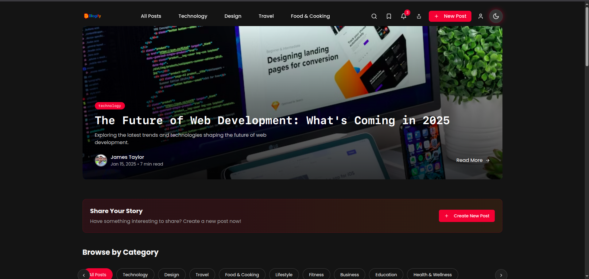
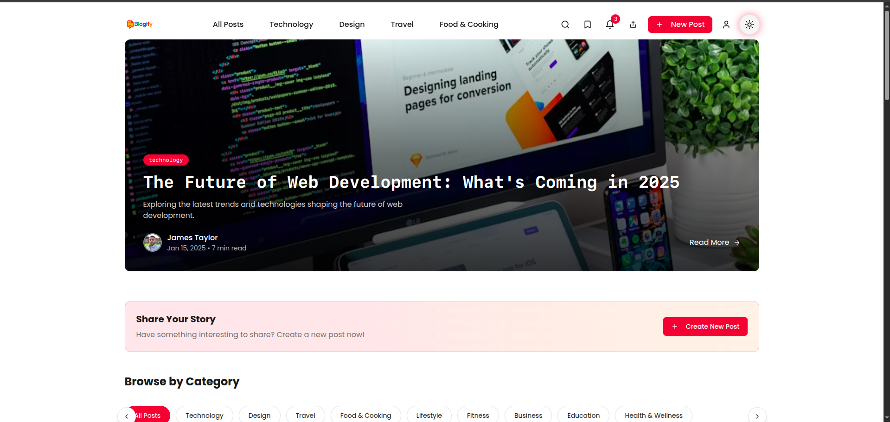

# CrimsonBlog 📝

A modern, feature-rich blogging platform built with React, TypeScript, and Tailwind CSS.

## ✨ Features

- 🌓 Dark/Light mode support
- 🔍 Advanced search functionality with command palette (⌘K)
- 📱 Fully responsive design
- 🔖 Bookmark system for posts
- 🔔 Notification system
- 📂 Category-based post organization
- 🎨 Modern UI with animations using Framer Motion
- 📤 Social sharing capabilities
- ⌨️ Keyboard shortcuts support

## 🖼️ Screenshots

<div style="display: flex; gap: 10px; margin-bottom: 20px;">
    
    
</div>

<!-- Add these screenshots to your public/screenshots directory -->

## 🚀 Tech Stack

- [React](https://reactjs.org/)
- [TypeScript](https://www.typescriptlang.org/)
- [Tailwind CSS](https://tailwindcss.com/)
- [Framer Motion](https://www.framer.com/motion/)
- [React Router](https://reactrouter.com/)
- [Lucide Icons](https://lucide.dev/)

## 🛠️ Installation

1. Clone the repository:
```bash
git clone https://github.com/Vegadjay/crimsonblog.git
```

2. Install dependencies:
```bash
cd crimsonblog
npm install
```

3. Start the development server:
```bash
npm run dev
```

## 📁 Project Structure

## 🎨 Customization

### Theme

The project uses a custom theme system built with Tailwind CSS. You can modify the theme colors in `tailwind.config.ts`:

```typescript
theme: {
  extend: {
    colors: {
      primary: "hsl(var(--primary))",
      secondary: "hsl(var(--secondary))",
      // ... other color definitions
    }
  }
}
```

## 📱 Responsive Design

The application is fully responsive with breakpoints:
- Mobile: Default
- Tablet: `md:` (768px)
- Desktop: `lg:` (1024px)
- Large Desktop: `2xl:` (1400px)

## 🤝 Contributing

Contributions are welcome! Please feel free to submit a Pull Request.

1. Fork the project
2. Create your feature branch (`git checkout -b feature/AmazingFeature`)
3. Commit your changes (`git commit -m 'Add some AmazingFeature'`)
4. Push to the branch (`git push origin feature/AmazingFeature`)
5. Open a Pull Request

## 📄 License

This project is licensed under the MIT License - see the [LICENSE](LICENSE) file for details.

## 👏 Acknowledgments

- [Shadcn UI](https://ui.shadcn.com/) for UI components inspiration
- [Lucide Icons](https://lucide.dev/) for beautiful icons
- [Framer Motion](https://www.framer.com/motion/) for smooth animations

---

Made with ❤️ by [Your Name]